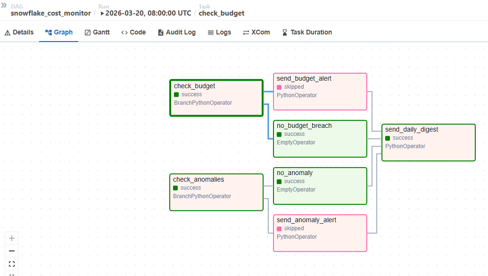

# Snowflake Cost Monitor

## What It Does

Three checks run automatically at 08:00 UTC every day:

**Anomaly detection** — compares each warehouse's spend yesterday against
its 7-day rolling average. If any warehouse ran 30% or more above its
normal baseline, a Slack alert fires immediately.

**Budget guard** — adds up everything spent across all warehouses yesterday.
If the total exceeds your configured daily credit limit, another Slack
alert fires.

**Daily digest** — regardless of whether anything went wrong, a morning
summary lands in Slack with a warehouse-by-warehouse cost breakdown,
credit totals, and estimated USD spend.

The two checks run in parallel. The digest always fires last.

---

## Pipeline



## Stack

**Orchestration** Apache Airflow 2.9 
**Data warehouse** Snowflake Enterprise (AWS) 
**Containerization** Docker + Docker Compose 
**Alerting** Slack Incoming Webhooks 
**Language** Python 3.12 
**Testing**  pytest — 11 unit tests, no credentials needed 


## How to Use It

**1. Clone the repo and configure your environment**

**2. Start the stack**
```bash
docker compose up airflow-init   # first time only
docker compose up -d
```

**3. Open Airflow and enable the DAG**

Go to `http://localhost:8080` and log in with `admin / admin`.
Find `snowflake_cost_monitor`, toggle it on.
It runs automatically every morning at 08:00 UTC.

To trigger it manually right now:
```bash
docker compose exec airflow-scheduler \
  airflow dags trigger snowflake_cost_monitor
```

**4. Run the tests**
```bash
python3 -m pytest tests/ -v
```

No Snowflake credentials or Slack webhook needed — all HTTP calls are mocked. Expected output: 11 passed.
